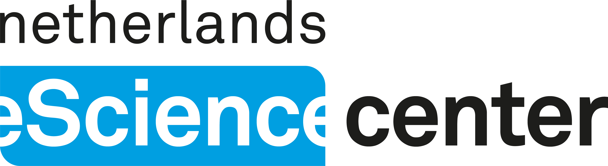
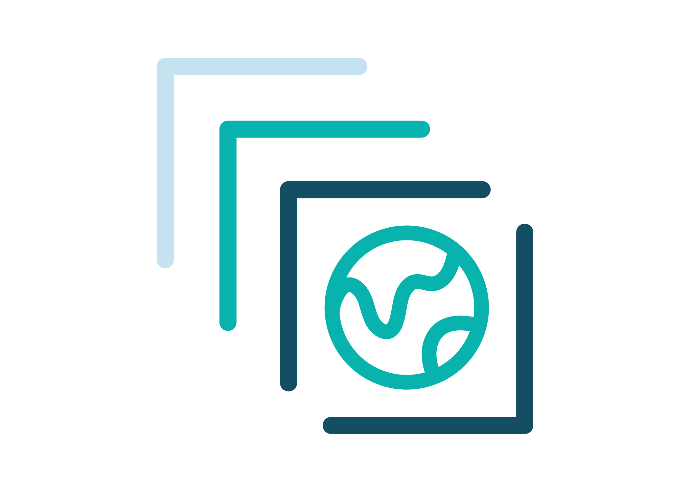

## <!-- Netherlands eScience Center --> {background-image="fig/escience-center-banner.png" background-size="100% auto" background-position="top"}

{.absolute top=420 left=275 width=500}

::: footer
[www.esciencecenter.nl](https://www.esciencecenter.nl)
:::

##

Cloud-native tools are available, yet *download and process locally* is still common practice.

{.nostretch fig-align="center" width=500}

## Challenges for researchers

Not just *accessing* cloud-native data, but being able to *use* it.

::: {.incremental}
- Few hands-on, domain-specific training materials.
- Tutorials teach the *how* of COGs, STAC, Zarr, not the *why* or *when*.
- Not systematically part of GIS / geoinformatics curricula.
- Fast-moving tools: tutorials break or go stale.
- Focus on consuming data, not on creating or serving it.
- HPC-oriented infrastructure: easier to get supercomputer access than object storage.
:::

## {.center .centered}

CLOUD-NES aims to investigate and promote cloud-native research data practices in the Natural and Engineering Sciences (NES).

::: {.r-hstack style="gap: 40px;"}
{height=80}

{height=80}

{height=80}

{height=80}
:::

::: {.footer style="max-width: 80%; left: 0; right: 0;"}
The project "CLOUD-NES" with file number ICT.001.TDCC.016 of the research programme NWO Thematic Digital Competence Centers (TDCCs) 2023-2 is financed by the Dutch Research Council (NWO).
:::

## Infrastructure + Skills + Community = Sustainable Practices {.centered-title}

- **Infrastructure**: cloud-based access, open data, shared compute
- **Skills**: access, but also process and publish with cloud-native tools
- **Community**: learn, experiment, and advance best practices together

## 1. Infrastructure

:::: {.columns .centered}

::: {.column .centered width="30%"}
{height=200}

Object store
:::

::: {.column .centered width="30%"}
{height=200}

JupyterHub
:::

::: {.column .centered width="30%"}
{height=200}

STAC catalog
:::

::::

::: {.fragment .centered}
Not an operational platform: a space to experiment and learn.
:::

## Twin platforms

:::: {.columns .centered}

::: {.column .centered width="50%"}
{height=120}

National research ICT infrastructure
:::

::: {.column .centered width="50%"}
{height=120}

On-premise deployment
:::

::::
