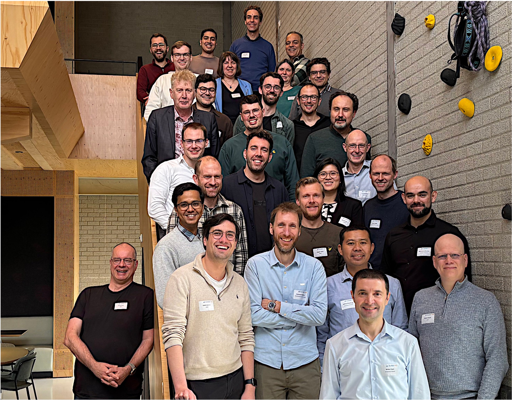

## <!-- Netherlands eScience Center --> {background-image="fig/escience-center-banner.png" background-size="100% auto" background-position="top"}

{.absolute top=420 left=275 width=500}

::: footer
[www.esciencecenter.nl](https://www.esciencecenter.nl)
:::

##

Cloud-native tools are available, yet *download and process locally* is still common practice.

{.nostretch fig-align="center" width=500}

## Challenges for researchers

Not just *accessing* cloud-native data, but being able to *use* it.

::: {.incremental}
- Not systematically part of GIS / geoinformatics curricula.
- Few hands-on, domain-specific training materials.
- Tutorials teach the *how* of COGs, STAC, Zarr, not the *why* or *when*.
- Fast-moving tools: tutorials break or go stale.
- Focus on consuming data, not on creating or serving it.
- Research infrastructure has grown around HPC: object storage is newer territory.
:::

## {.center .centered}

CLOUD-NES aims to investigate and promote cloud-native research data practices in the Natural and Engineering Sciences (NES).

::: {.r-hstack style="gap: 40px;"}
{height=80}

{height=80}

{height=80}

{height=80}
:::

[`cloudnes.org`](https://cloudnes.org){preview-link="false"}

::: {.footer style="max-width: 80%; left: 0; right: 0;"}
The project "CLOUD-NES" with file number ICT.001.TDCC.016 of the research programme NWO Thematic Digital Competence Centers (TDCCs) 2023-2 is financed by the Dutch Research Council (NWO).
:::

## Infrastructure + Skills + Community = Sustainable Practices {.centered-title}

- **Infrastructure**: cloud-based access for benchmarks and capacity building.
- **Skills**: access, but also process and publish with cloud-native tools.
- **Community**: learn, experiment, and advance best practices together.

## 1. Infrastructure

:::: {.columns .centered}

::: {.column .centered width="30%"}
{height=200}

Object store
:::

::: {.column .centered width="30%"}
{height=200}

JupyterHub
:::

::: {.column .centered width="30%"}
{height=200}

STAC catalog
:::

::::

::: {.centered}
Not an operational platform: a space to experiment and learn.
:::

## Twin platforms

:::: {.columns .centered}

::: {.column .centered width="50%"}
{height=120}

National research ICT infrastructure:

**Central, managed, free to use for Dutch researchers.**
:::

::: {.column .centered width="50%"}
{height=120}

On-premise deployment:

**Demonstrates applicability across different infrastructures.**
:::

::::

## Datasets {.smaller}

* Datasets from PDOK (*Publieke Dienstverlening Op de Kaart*) and KNMI.
* Openly available in the cloud, via OGC services and file download.
* Cloud-native formats are not yet common: a good place to learn.

| Dataset | Current format | Cloud-native target |
|---|---|---|
| AHN DEM (raster) | GeoTIFF | COG |
| Aerial imagery (RGB + NIR) | GeoTIFF | COG |
| KNMI daily temperature | NetCDF3 | Zarr |

## Benchmarks {.smaller}

Quantitative, reproducible evidence of *when* cloud-native pays off.

Badly tuned cloud-optimized datasets can be *worse* than the original.

:::: {.columns}

::: {.column width="50%"}
**What we compare**

- Original files (GeoTIFF, NetCDF) vs. COG and Zarr.
- Virtual cubes on top of the originals and transformed: STAC, VRT, virtual Zarr.
- Chunk shape, chunk size, compression.
:::

::: {.column width="50%"}
**How we measure**

- Different scenarios, e.g. *deep* (time series) vs. *wide* (mosaic).
- Metrics: not only time to access, also data transferred and number of HTTP requests.
- Co-located vs. remote analysis, on both platforms.
:::

::::

## Where we stand

- Development versions of both deployments are up and running.
- Now working on datasets and benchmarks.
- Early demonstration of STAC catalog for AHN data products.
- Building tools to facilitate monitoring the *amount of data transferred* and the *number of requests* performed when accessing data:

  [ `CLOUD-NES/cloudgeometer`](https://github.com/CLOUD-NES/cloudgeometer)

::: {.fragment}
- ❤️ `stac-geoparquet`, `rustac`, `rustfs`.
:::

## 2. Skills

- Translate best practices and lessons learned into training material.
- Organize two types of trainings for researchers:
  - how to *access* cloud-optimized datasets.
  - how to *generate* and *distribute* datasets using cloud-native tooling.
- Six hands-on events, with open training materials.
- Embed these into eScience Center trainings and University of Twente curricula.

## 3. Community {.smaller}

**Symposium on Cloud-Native Data in Natural and Engineering Sciences**

:::: {.columns}

::: {.column width="58%"}
1 April 2026, Utrecht: 35 participants from research, data infrastructures, and policy.

- Keynotes from thriveGeo, OpenGeoHub, and moreGeo: *why cloud-native data?*
- Stakeholder perspectives from Geonovum, KNMI, SURF, eScience Center, UT-ITC.
- Breakout session on gaps, needs, and potential solutions.
:::

::: {.column width="42%"}

:::

::::

::: {.fragment}
A second symposium in mid-2027 will share results and lessons learned.
:::

## What we heard {.smaller}

:::: {.columns}

::: {.column width="33%"}
**Formats & standards**

- Many formats to choose from: hard for newcomers.
- Need guidance, best practices, and examples showing *why* a new format is better.
- Help in choosing among existing standards.
:::

::: {.column width="33%"}
**Infrastructure**

- Wish for more choice and portability.
- Cloud costs are hard to forecast.
- Need local options and cost monitoring.
:::

::: {.column width="33%"}
**Training**

- Fragmented materials that go stale quickly.
- Need time and incentives to change.
- Use-case specific advice; Carpentries-style lessons co-designed with users.
:::

::::

::: aside
All outcomes: [`doi.org/10.5281/zenodo.19918473`](https://doi.org/10.5281/zenodo.19918473)
:::

## {.center .centered .smaller}

CLOUD-NES aims to investigate and promote cloud-native research data practices in the Natural and Engineering Sciences (NES).

**Formats to benchmark? Datasets to convert? Scenarios we should test?**

::: {.r-hstack style="gap: 40px;"}
{height=80}

{height=80}

{height=80}

{height=80}
:::

[`cloudnes.org`](https://cloudnes.org){preview-link="false"}

[`github.com/CLOUD-NES`](https://github.com/CLOUD-NES){preview-link="false"}

[`zenodo.org/communities/cloud-nes`](https://zenodo.org/communities/cloud-nes){preview-link="false"}

::: {.footer style="max-width: 80%; left: 0; right: 0;"}
The project "CLOUD-NES" with file number ICT.001.TDCC.016 of the research programme NWO Thematic Digital Competence Centers (TDCCs) 2023-2 is financed by the Dutch Research Council (NWO).
:::
